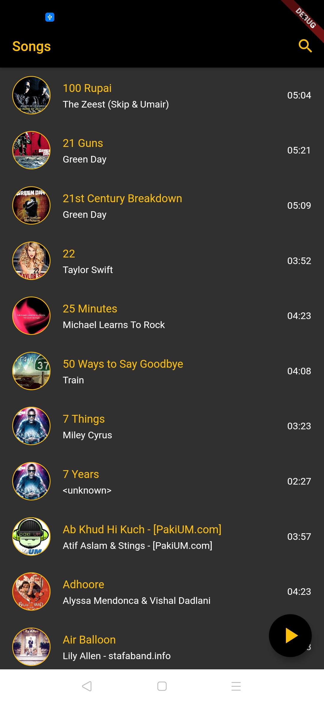
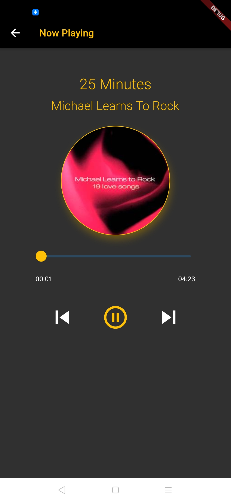

# Music Player

A music player built using Flutter

## Features
- Play songs from local storage
- Play/pause current song
- Skip to next/previous song

## Tools Used
- Flutter
- ChangeNotifierProvider
- Flutter Audio Query plugin

## Screenshots
 
