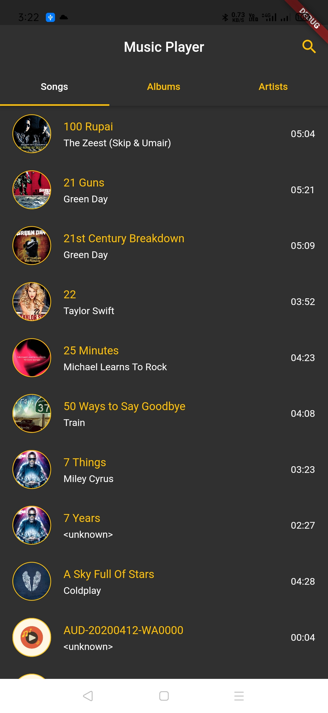
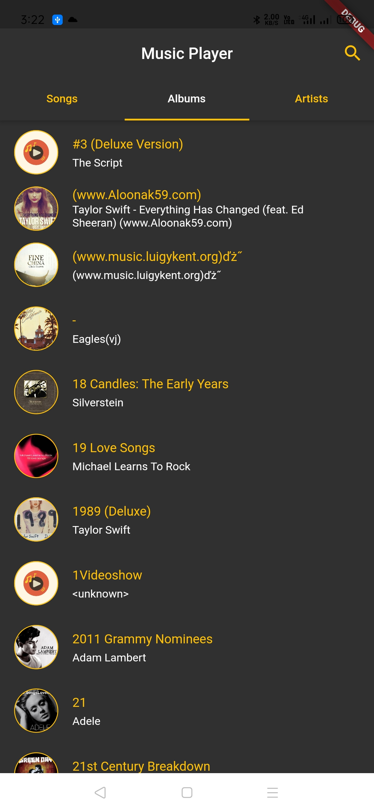
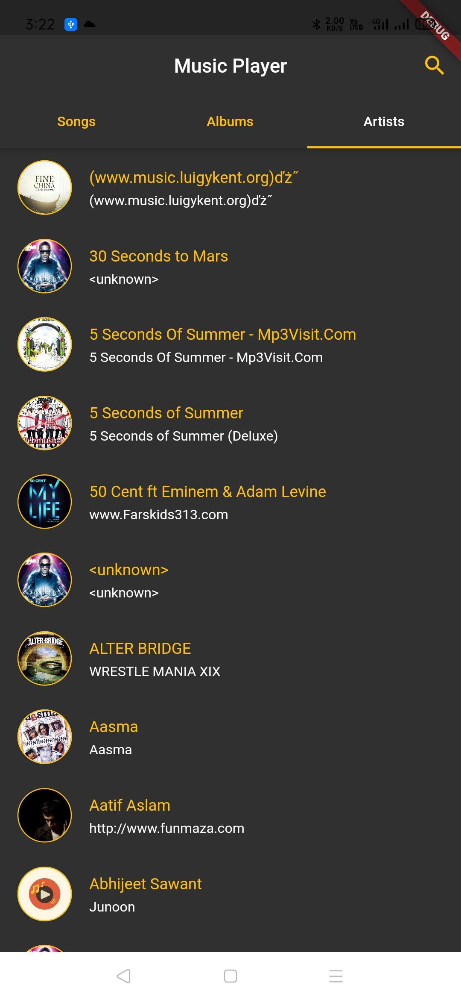
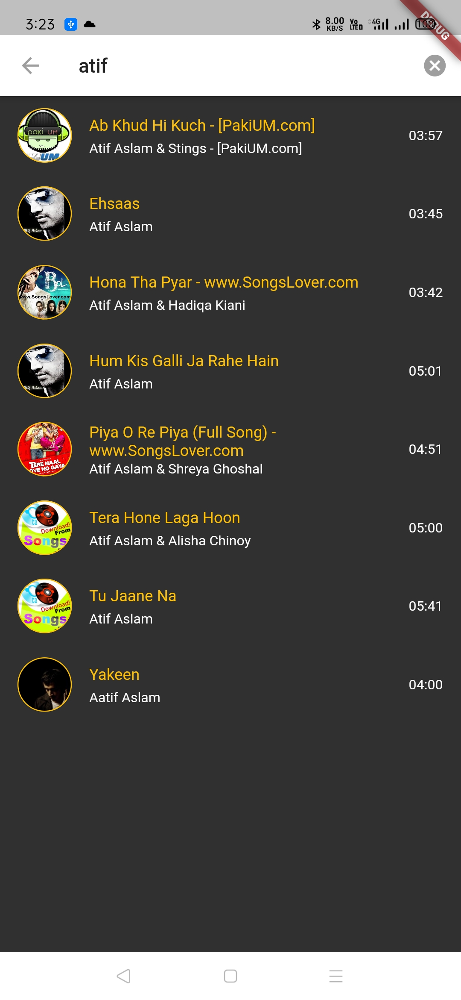
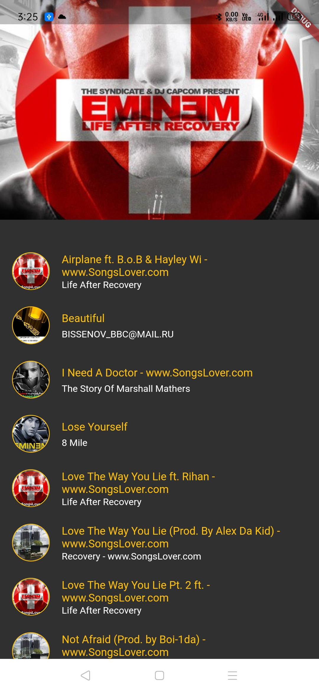
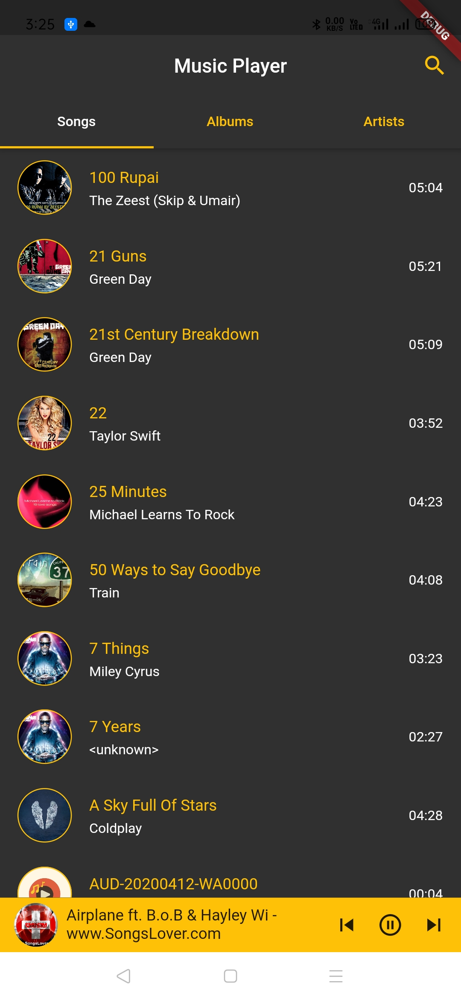

# Music Player

A music player built using Flutter.

Link to apk: https://drive.google.com/file/d/1sPgupNiKouBWgtPKc9dBhhIBk5pyjJj9/view

## Features
- Play songs from local storage
- SQLite database for storing song information and quering songs
- Play/pause current song
- Skip to next/previous song
- Search songs
- Songs grouped based on albums and artists
- Control song from bottom bar
- Provider package for state management

## Technologies Used
- Flutter
- SQLlite

## Screenshots
       