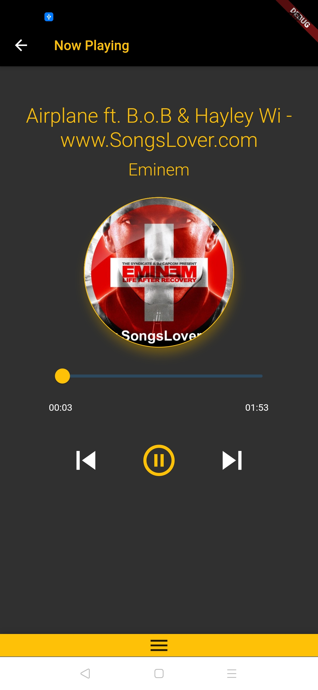

# Music Player

A music player built using Flutter.

## Features
- Play songs from local storage
- Sqflite database for quering songs
- Play/pause current song
- Skip to next/previous song
- Search songs
- Songs grouped based on albums and artists
- Control song from bottom bar

## Tools Used
- Flutter
- Sqflite
- ChangeNotifierProvider
- Flutter Audio Query plugin

## Screenshots
       